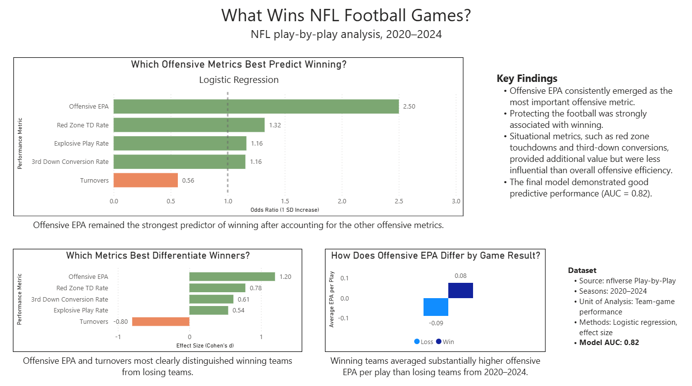

# nfl-data-analysis
NFL data analytics project using R, SQL, and Power BI to identify the factors most associated with winning NFL games.
An end-to-end NFL analytics project using **R, SQL, Power BI, and GitHub** to identify which offensive metrics are most associated with winning NFL games.

## Tools

- R
- SQL (MySQL)
- Power BI
- GitHub
- NFLverse

## Data

- NFL play-by-play data (2020–2024)
- Source: NFLverse

## Analysis

This project includes:

- Data cleaning and feature engineering
- Team-level game summaries
- Cohen's d effect sizes
- Logistic regression
- ROC/AUC model evaluation
- Interactive Power BI dashboard

## Key Findings

- Offensive EPA was the strongest predictor of winning.
- Turnovers had the largest negative effect on win probability.
- Red zone touchdown rate and third-down conversion rate also contributed to winning.

## Dashboard

